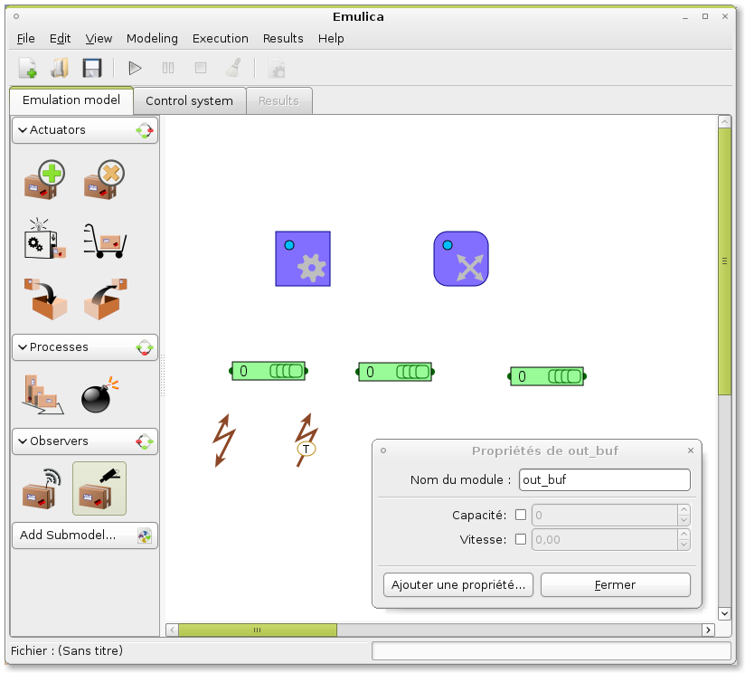
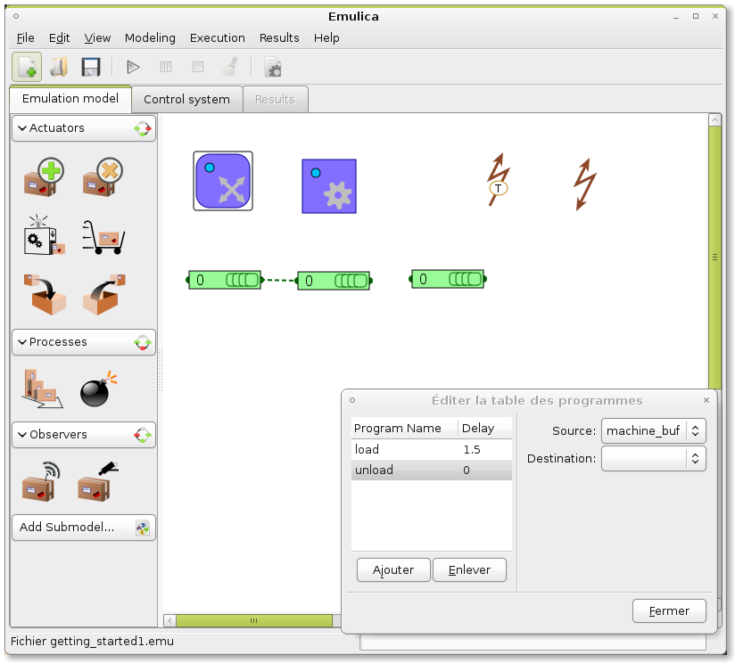
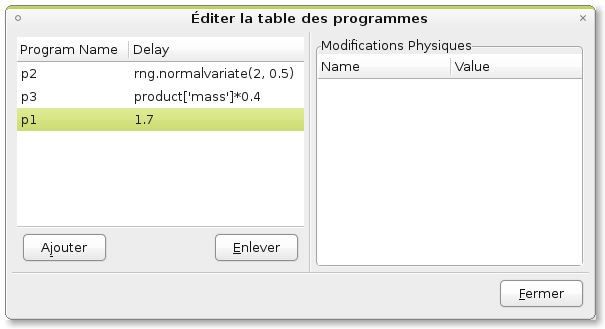
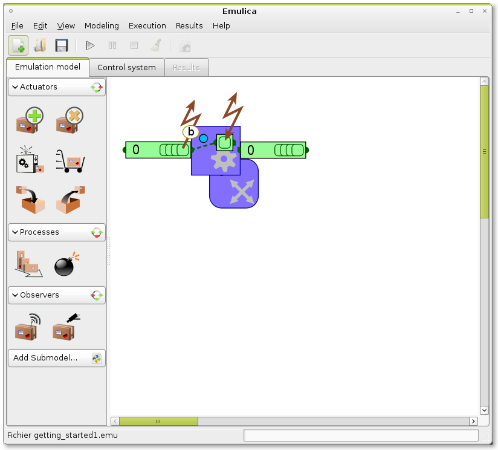
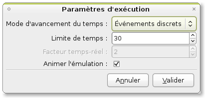
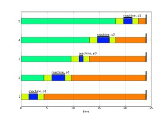
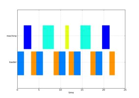

A short modelling tutorial
==========================

This document show the steps to create the model of a simple shopfloor system.
The system that we try to model is a simple three-machine shop floor, with a 
completely flexible routing.

This shop floor can be broken into four parts : 3 identical production cells, 
and a transport system between them.

.. contents:: Contents
   :depth: 3

Modelling a (simple) cell
-------------------------

Emulation Model
^^^^^^^^^^^^^^^^^^^

Lets first begin with the emulation model.

Each cells have an (infinite) input and output buffer, modelled as product holders,
while another product holder models the place where the product resides while 
being worked on. 

A Space actuator enable to load and unload the production cell, and a Shape 
actuator do the actual transformation job on the products.

Finally, we must add observers so that the shopfloor control system will be aware 
of products arrivals. There are two observers : an automatic one that trigger an
event when a product arrives (this observer push the event into the control 
system), or a manual one that run when requested by the control system (i.e. the
control system pull the data from the observer). Here, we will use one automatic
observers, that will send reports when products in the input buffer will be ready
and a manual observer that will give information about the products residing in 
the machine.

After adding all these modules to the model, we will give them more useful 
names than the default, using the property dialog of each module. NB: if several 
modules are selected, a properties dialog box will open for each one.

let's name the products holders `in_buf`, `out_buf`, and `machine_buf`. The 
Shape actuator will be named `machine` and the Space actuator `loader`. The
observers are named `in_buf_obs` and `machine_obs`.

Now, we must create some links between our holders : the space actuator `loader`
has the role of transferring products between holders. Each possible route 
(each couple of holder) is represented by a program. In `loader` properties, we 
will add two programs, 'load' and 'unload', with source and destination (in_buf,
machine_buf) and (machine_buf,out_buf), respectively. Dashed lines between 
holders appear. If we want to consider loading/unloading times, a delay can be 
added (which can be different for each operation). Here we will use a loading 
delay of 1.5 time units, and an unloading delay of 1.2. Transfert delays might
usually be considered to be null, for more simplicity.

Then, we must configure our shape actuator `machine`. First, we define the 
'holder' property of `machine` to `machine_buf`: this is where the product lies 
when they are transformed. Then we must add some programs to the actuator: like 
for the space actuator, the action that can be done by a shape actuator are programs.
Let's consider that our machine can do 3 differents operations (named p1 to p3).
We add them to the program table of `machine`. To each program, we can affect a 
delay, and a set of physical changes on the product properties. The delay can be
either a numerical value, or an expression. Some token can be used to bouild expressions:

    * `rng`: the model's random number generator, a random.Random instance
    * `product`: the current product that is worked on
    * `model`: the model where the module is.
 
So, program p1 will have the delay "1.7", program p2 will have the delay 
"rng.normvariate(2, 0.5)", to get a stochastic delay following a normal 
distribution. Finally program p3's delay will be "product['mass'] * 0.4", to 
get a delay proportional to the mass of the product. NB: the background color turns
yellow if there is an evaluation problem.

Finally, we must set up the observers. Automatic observers have a configurable
observation capability, in order to model the actual observation capacities 
available on the shop floor system : is the most simple configuration, the 
observer behave like a presence detector: it sends a report when a product is at
the front of the observed holder. But automatic observers can also observe 
product types and even identify products (liake an RFID or bar code reader). 
Here, we choose a simple presence detector for in_buf_observer.

We have now a working emulation model (It is very simple, but we will add more
feature later). Well, to this model cannot be simulated now, because it's 
completely devoid of control. It is as inert as a real shopfloor without PLC 
programs or operators. 

So, the next step is to code a simple control routine.

Control System
^^^^^^^^^^^^^^

The Control system is written in python, and use generators. Emulica embed a source
code editor, that enable to easily write code. It can also be imported from a file.
In the code editor, we can find a "add snippet" button. We will use it to get 
a basic control structure faster:

Using the add snippet feature, we add first the main import, then a Empty 
control class (that we rename 'ControlMachine'), and we finish by updating the 
initialization function.

The control code now looks like:: 

    from emulation import Process

    class ControlMachine(Process):
        def run(self, model):
            from emulation import Process, put, get, Report, Request, wait_idle
            #write control routine here
            
    def initialize_control(locals_, model):
        model.register_control(locals_['ControlMachine'])

In this code, we can see three parts:
    * import statements, that fetch necessary objects from the emulation python module
    * class declarations: each correspond to a control process. Control processes are the building block of control. They listen for event (report) comming from the emulated system and send back control requests. 
    * a function named initialize_control, where the control processes are declared in the model.

It is time now to actually write the control algorithm;
The control process behave according to these steps:

    #. When a product arrives, load it
    #. When the loading is finished, examine the product to get its type
    #. setup the machine according to the product's type, and begin machining
    #. when finished, unload the product
    
Each module has a request and a report socket. The report_socket is used to get
event or, more precisely *Reports* from the module, while the request_socket is 
used to send Request to it. To get a report socket of a module, the 
create_report_socket function must be used. In our example, we will ned to get
events from both observers, machine and loader::

    from emulation import Process

    class ControlMachine(Process):
        def run(self, model):
            from emulation import Process, put, get, Report, Request, wait_idle
            #get modules and report sockets
            in_obs = model.get_module('in_obs')
            rp_in_obs = in_obs.create_report_socket()
            loader = model.get_module('loader')
            rp_loader = loader.create_report_socket()
            machine = model.get_module('machine')
            rp_machine = machine.create_report_socket()
            machine_obs = model.get_module('machine_obs')
            rp_machine_obs = machine_obs.create_report_socket()
            
    def initialize_control(locals_, model):
        model.register_control(locals_['ControlMachine'])
        
    
Now  we must wait for a product to arrive the input buffer: This is done using SimPy's
yiend get instruction, where rp_in_obs is the Store where to pick events::

    yield get, self, rp_in_obs, 1
    ev = self.got[0]

'ev' is the Report object corresponding to the arrival of a product at the first position
of the holder. A Report has six attributes:

    * *who* the entity in the model that must execute the action
    * *what* the name of the action to be executed
    * *how* a dictionary of parameters to configure the action
    * *when* the date at which the action must be executed
    * *where* the location where the action must be executed (i.e. the same as who in most cases)
    * *why* a human-readable comment string

When a product arrives, it must be loaded into machine_buf; that the 'load' 
program of the actuator loader is for. So we create a request, and sent it to the 
actuator using a 'yield put' statement::

    request = Request('loader', 'move', params = {'program': 'load'})
    yield put, self, loader.request_socket, [request]
    
Then, the control must wait for the loading to end: a shortcut to make that is 
to use the wait_idle generator. As it is a generator, and not a function, we must
get all the requests that it yield, and yield them back::

    for e in wait_idle(self, rp_loader): yield e
    
Writting the rest of the control code is straightforward. The final step is to 
enclose the whole in a loop, so that the control sequence is repeated indefinitely::

    class ControlMachine(Process):
        def run(self, model):
            from emulation import Process, put, get, Report, Request, wait_idle
            #get modules and report sockets
            in_obs = model.get_module('in_obs')
            rp_in_obs = in_obs.create_report_socket()
            loader = model.get_module('loader')
            rp_loader = loader.create_report_socket()
            machine = model.get_module('machine')
            rp_machine = machine.create_report_socket()
            machine_obs = model.get_module('machine_obs')
            rp_machine_obs = machine_obs.create_report_socket()
             while True:
                yield get, self, rp_in_obs, 1
                ev = self.got[0]
                request = Request('loader', 'move', params = {'program': 'load'})
                yield put, self, loader.request_socket, [request]
                for e in wait_idle(self, rp_loader): yield e
                yield put, self, machine.request_socket, [Request('machine', 'make', params = {'program': 'p1'})]
                for e in wait_idle(self, rp_machine): yield e
                yield put, self, loader.request_socket, [Request('loader', 'move', params = {'program': 'unload'})]
                for e in wait_idle(self, rp_machine): yield e
        
This control system works, but it always apply the same program. It would be more realistic to
base the program to the type of the product curently loaded. In order to do that,
we will use observer `machine_obs`: when a product is loaded, we will issue an
observation Request, receive an observation Report from where we will find the 
product type, and choose the program according to the products type. For more simplicity,
let's consider that we have three types of product, with type 1 corresponding to
program `p1`, type 2 to `p2`, etc...

Let's code ths part::
    
    yield put, self, machine_obs.request_socket, [Request('machine_obs', 'observe')]
    yield get, self, rp_machine_obs, 1
    ev = self.got[0]
    product_type = ev.how['Type_by_position'][0]
    prog = "p{0}".format(product_type)

This code should be inserted before we send a Request to machine. Moreover the 
request must be modified so as to use the value we have just computed from the type.

Finally the control buffer contains the following code::

    from emulation import Process
    class ControlProcess(Process):
        def run(self, model):
            from emulation import Process, put, get, Report, Request, wait_idle
            in_buf_obs = model.get_module('in_buf_obs')
            rp_in_obs = in_buf_obs.create_report_socket()
            loader = model.get_module('loader')
            rp_loader = loader.create_report_socket()
            machine = model.get_module('machine')
            rp_machine = machine.create_report_socket()
            machine_obs = model.get_module('machine_obs')
            rp_machine_obs = machine_obs.create_report_socket()

            while(True):
                #1 we wait for a product to be ready
                yield get, self, rp_in_obs, 1
                #2 we request the loader to execute the load program
                request = Request('loader', 'move', params = {'program': 'load'})
                yield put, self, loader.request_socket, [request]
                #we wait for the loader to finish (ie return to idle state)
                for e in wait_idle(self, rp_loader): yield e
                #we send an observation request to machin_obs, and we wait the answer
                yield put, self, machine_obs.request_socket, [Request('machine_obs', 'observe')]
                yield get, self, rp_machine_obs, 1
                ev = self.got[0]
                product_type = ev.how['Type_by_position'][0]
                prog = "p{0}".format(product_type)
                print prog
                yield put, self, machine.request_socket, [Request('machine', 'make', params = {'program': prog})]
                for e in wait_idle(self, rp_machine): yield e
                yield put, self, loader.request_socket, [Request('loader', 'move', params = {'program': 'unload'})]
                for e in wait_idle(self, rp_loader): yield e

    def initialize_control(locals_, model):
        model.register_control(locals_['ControlProcess'])
        
        
Experiments
^^^^^^^^^^^

To experiment with our cell, we must creates some products, and send them to the
input buffer. So we add a create actuator the the emulation model, connect it to
in_buf, and write a simple control process that creates 5 products::

    class ControlCreate(Process):
    
        def run(self, model):
            from emulation import Process, put, get, Report, Request, wait_idle
            CreateAct5 = model.get_module('CreateAct5')
            create = model.get_module('create')
            yield put, self, create.request_socket, [Request('create', 'create', params = {'productType': 1})]
            yield put, self, create.request_socket, [Request('create', 'create', params = {'productType': 2})]
            yield put, self, create.request_socket, [Request('create', 'create', params = {'productType': 3})]
            yield put, self, create.request_socket, [Request('create', 'create', params = {'productType': 2})]
            yield put, self, create.request_socket, [Request('create', 'create', params = {'productType': 1})]
            
After updating the initilisation function (so that our new ControlCreate process
is registered into the model), we can begin makin some experiment with our model.

Two execution modes can be used:  discrete-events and real-time. In real time, 
emulation time follow the computer time, multiplied by a ration. By default, this
ratio is 2, which means that one time unit in emulation elapses in 2 seconds.

In real time, te simulation is executed as fast as possible.

If the animate option is checked, the emulation model is graphically animated.

After a successfull simulation run, results can be created. 

Modelling several cells and the routing system
----------------------------------------------

